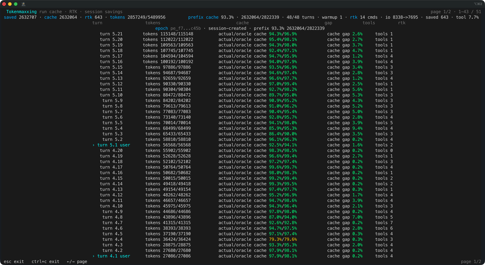

<p align="center">
  
</p>

<p align="center">
  <strong>Inference-native Tokenmaxxing Agent Harness</strong>
</p>

<p align="center">
  <a href="https://github.com/agentic-in/inferoa">GitHub</a>
  ·
  <a href="https://inferoa.agentic-in.ai/docs/intro">Docs</a>
  ·
  <a href="website/blog/2026-06-08-announcing-inferoa.md">Blog</a>
</p>

Most agents call models as if inference were a **black box**. The agent loop,
router, serving engine, context system, and multimodal path are usually split
apart, so the agent cannot tokenmaxx across the optimization rules that modern
inference systems make possible.

> Prefix cache stability is ignored. Routing is
bolted on later. Context is pasted until it fits. Users pay for that gap.

Inferoa is an **Inference-native Tokenmaxxing Agent Harness** for long-horizon
tasks. It starts from the inference stack and designs the agent loop around
tokenmaxxing: prefix-cache discipline, context optimization, intelligent
routing, high-throughput and memory-efficient vLLM serving, multimodal
capability.

## TUI Preview

<div align="center">
  <table>
    <tr>
      <th>Welcome</th>
      <th>Tokenmaxxing</th>
    </tr>
    <tr>
      <td align="center"></td>
      <td align="center"></td>
    </tr>
    <tr>
      <th>Prefix Cache Status</th>
      <th>Goal Mode</th>
    </tr>
    <tr>
      <td align="center"></td>
      <td align="center"></td>
    </tr>
    <tr>
      <th>Plan Mode</th>
      <th>Autoresearch Mode</th>
    </tr>
    <tr>
      <td align="center"></td>
      <td align="center"></td>
    </tr>
  </table>
</div>

## Why Inferoa

Inferoa = **Infer**(Inference-native)**o**(Tokenmaxxing)**a**(Agent Harness).

Long-horizon agents are not one prompt. They are many turns of planning,
editing, tool use, retries, compaction, cache warmup, route selection, and
verification. If the harness treats every turn as generic chat traffic, it
throws away the optimization surface underneath it.

Inferoa makes those tokenmaxxing surfaces first-class:

- **Prefix cache is protected**, not merely reported after the turn.
- **Goals, plans, and autoresearch** are native long-horizon modes.
- **Context is optimized** through compression, summaries, graph-shaped code
  context, bounded tool output, and evidence selection instead of pasting until
  the window is full.
- **Intelligent routing chooses the model path** by cost, safety, privacy,
  capability, and session pressure.
- **High-performance model serving is respected**: Inferoa follows inference
  engine optimization rules so high-throughput, memory-efficient vLLM serving
  is not treated like generic chat traffic.

## Tokenmaxxing Across The Inference Stack

Inferoa is built on top of the vLLM ecosystem and extends tokenmaxxing across
the inference stack:

| Surface | Substrate | Inferoa role | Tokenmaxxing target |
| --- | --- | --- | --- |
| Agent Harness | [Inferoa](https://github.com/agentic-in/inferoa) | Goals, plans, autoresearch, sessions, tools, recovery, verification, and prefix-cache discipline | Keep long-horizon work coherent while preserving reusable prompt prefixes |
| Context Optimization | [CodeGraph](https://www.npmjs.com/package/@colbymchenry/codegraph), [RTK](https://github.com/rtk-ai/rtk) | Select evidence and shrink mutable context without losing task continuity | Spend fewer prompt and tool-output tokens |
| Intelligent routing | [vLLM Semantic Router](https://github.com/vllm-project/semantic-router) | Choose model paths by cost, safety, privacy, capability, and session pressure | Avoid one expensive path for every turn |
| Model Serving | [vLLM Engine](https://github.com/vllm-project/vllm), [vLLM Omni](https://github.com/vllm-project/vllm-omni) | Use high-throughput, memory-efficient serving and multimodal endpoints while respecting inference-engine optimization rules | Improve latency, throughput, and cost without requiring every turn to use a frontier model |

## Core Design

- **Long-horizon modes**: goal, plan, and autoresearch are native workflows,
  not prompt templates.
- **Prefix-cache discipline**: stable prompt epochs, deterministic tool schemas,
  bounded context sections, and cache reports protect reusable prefixes.
- **Continuous context optimization**: compression, summaries, structured repo
  context, bounded history, and bounded tool output preserve evidence while
  reducing token pressure.
- **Intelligent routing**: model paths can respond to cost, safety, privacy,
  capability, and session pressure, including routing between self-hosted vLLM
  models and external frontier models.
- **Inference-engine alignment**: prompt shape, endpoint choice, throughput,
  memory efficiency, cache behavior, and model capacity remain visible to the
  harness so the agent can follow serving optimization rules.

## Installation

```bash
npm install -g inferoa
```

## Quickstart

```bash
inferoa setup
inferoa
```

Use the core commands as the task
grows:

- `/goal` keeps a durable objective, decomposition, evidence, and completion
  audit across long-running work.
- `/plan` turns ambiguous scope into an inspectable plan before execution.
- `/autoresearch` runs benchmark-style iteration with metrics and failure
  evidence in the same session.
- `/tokenmaxxing` shows token and cost pressure across prefix-cache reuse,
  context savings, recent turn usage, and model-selection pressure.

## Acknowledgements

Inferoa is built for and with the vLLM ecosystem:

- [vLLM Engine](https://github.com/vllm-project/vllm)
- [vLLM Semantic Router](https://github.com/vllm-project/semantic-router)
- [vLLM Omni](https://github.com/vllm-project/vllm-omni)

Inferoa also uses and acknowledges the projects that make context
optimization practical inside the agent loop:

- [RTK](https://github.com/rtk-ai/rtk)
- [CodeGraph](https://www.npmjs.com/package/@colbymchenry/codegraph)

## Contributors

<p align="center">
  
</p>

<p align="center">
  <strong>
    Agentic Intelligence Lab
  </strong>
</p>
