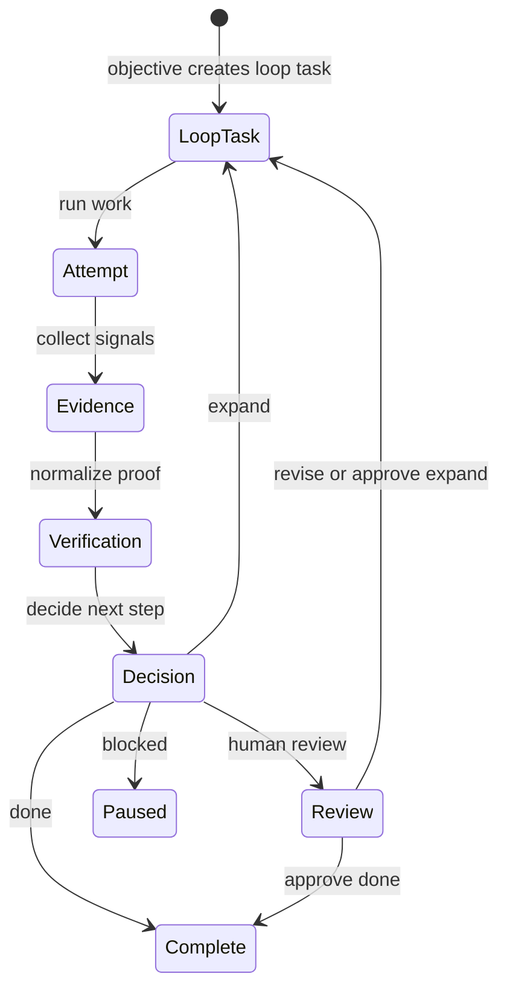
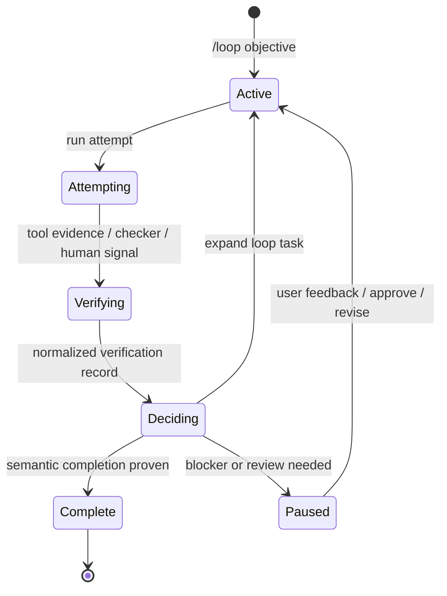

The next step for coding agents is not a longer prompt. It is a better loop.

In a normal chat session, you are the loop. You remember the objective, decide
the next step, inspect tool output, ask for another pass, and judge whether the
result is good enough. That works for short tasks. It starts to break when the
work spans many files, many tools, many attempts, or many hours.

**Loop Engineering** is the practice of designing that control loop instead of
hand-steering every prompt. A loop needs an objective, memory, tools, feedback,
verification, and a decision about what happens next.

Inferoa is built for that shift. It is an **inference-native TokenMaxxing agent
harness**: a runtime that treats the loop as the unit of work, and treats every
step inside that loop as an inference workload.

That second part matters. Long-running agents do not just need more autonomy.
They need better inference behavior. As turns accumulate, prompt prefixes drift,
cache reuse collapses, stale evidence fills context, model routing gets harder,
and serving choices start to shape the cost and reliability of the work.


This is where **Inference Native** and **TokenMaxxing** become practical, not
decorative. The loop has to see the substrate it is consuming: tokens, cache,
context, routes, endpoints, and model capacity. TokenMaxxing is the discipline
of spending tokens where they move the work forward, protecting reusable prefixes,
compressing what no longer needs to be verbatim, and routing each step to the
model path that fits the job.

Inferoa brings those pieces into one terminal-first harness: durable loops,
verification evidence, memory and context control, prefix-cache discipline,
intelligent routing through
[vLLM Semantic Router](https://github.com/vllm-project/semantic-router),
high-throughput serving with
[vLLM Engine](https://github.com/vllm-project/vllm), [vLLM Omni](https://github.com/vllm-project/vllm-omni)
multimodal capability, and TokenMaxxing observability across the work.


<!-- truncate -->

## The Shift

The bottleneck in agent work is moving.

At first, the hard part was prompting: write the right instruction, paste enough
context, hope the next answer is useful. Then tools made the agent more capable:
edit files, run tests, inspect logs, browse code, call APIs.

The new bottleneck is the loop around those tools. Can the system keep pursuing
the objective after one answer? Can it remember what was tried? Can it verify a
claim before declaring victory? Can it stop wasting context on evidence that no
longer matters? Can it route cheap mechanical steps away from expensive frontier
paths?

That is the product category Inferoa is designed for:

| Idea | What It Means | Why It Matters |
| --- | --- | --- |
| **Loop Engineering** | Design the objective, memory, feedback, verification, tools, and stop condition. | The agent can keep working beyond one prompt without losing the shape of the task. |
| **Inference Native** | Make tokens, prefix cache, context, routes, endpoints, and serving pressure visible to the loop. | The runtime can improve the next step before the next model call is sent. |
| **TokenMaxxing** | Maximize useful work per token, not merely minimize token count. | Long-horizon work becomes cheaper, more stable, and easier to reason about. |

The agent is not merely calling an inference system. The loop is shaped by it.

## What Breaks

Long-horizon agents are not one prompt. They are loops: plan, act, observe,
verify, remember, and decide whether to continue. If the runtime treats every
turn as generic chat traffic, it loses both sides of the optimization surface:
the feedback that drives self-correction and the inference signals that keep the
workload efficient.


The failure modes are familiar:

- the objective is present, but the feedback loop is too weak to drive correction;
- grading collapses into self-critique instead of independent evidence;
- memory becomes a pile of notes instead of a reusable spine;
- prompt shape drifts, so prefix cache cannot be reused reliably;
- context selection becomes "paste more" instead of "select better";
- cheap, private, or mechanical turns still take expensive model paths;
- serving and cache signals arrive too late to shape the next action.

These are runtime design problems, not dashboard problems. A chart after the fact
does not help the next turn. The loop has to use those signals while it is still
running.

## What Inferoa Changes

Inferoa makes loop state and inference state part of the same runtime.

The point is not to wrap an agent in another UI. The point is to let the runtime
choose better prompts, better context, better routes, and better recovery
behavior before the next turn is sent.


In Inferoa, the loop carries the objective, current work slice, attempts, tool
trace, verification evidence, decisions, and learned workspace policy. The
inference layer carries the context shape, prefix-cache discipline, routing
choices, serving endpoints, and token pressure. TokenMaxxing connects the two.

That is the core design: make the loop visible enough to improve, and make the
inference workload visible enough to control.

## What `/loop` Changes

`/loop` is the user-facing control surface for this.

Instead of asking the model for the next answer and then manually deciding what
to ask next, you give Inferoa an objective. Inferoa creates a durable loop,
orients on the workspace, slices the work into bounded loop tasks, records
attempts, attaches evidence, verifies progress, and decides whether to continue,
pause, ask for review, or complete.

At the loop level, that work is one small decision cycle:



The important difference is ownership of the repeated work. The human still owns
the outcome. Inferoa carries the scheduling, memory, evidence, and verification
machinery that the human would otherwise perform turn by turn.

The first product change is vocabulary. A chat session is still a conversation,
but a loop makes the units of work explicit:

| Term | Meaning | Relationship |
| --- | --- | --- |
| **Session** | The durable conversation and transcript. | Contains runs, tool traces, resources, loop state, memory, and prompt epochs. |
| **Run** | One execution of the agent runtime from prompt to terminal result. | A run can include multiple steps and tool calls. Outside loop mode, it is just normal session work. |
| **Step** | One model request and response cycle inside a run. | A step may produce assistant text, tool calls, or both. |
| **Prompt epoch** | The stable prompt-prefix version used for model requests. | Belongs to a session and is attached to steps; it changes when stable prompt layout, model/provider, cache salt, or tool schema changes. |
| **Loop** | The durable controller for a long-horizon objective. | Owns loop tasks, attempts, verification, decisions, candidates, HIL policy, and completion evidence. |
| **Loop task** | A bounded horizon inside the loop. | Loop task 0 orients; later tasks are opened by `expand` decisions. |
| **Attempt** | A run interpreted as progress, verification, reflection, or control for the current loop task. | Attempt is the loop lens on a run: every attempt is backed by a run, but not every run is a loop attempt. |
| **Verification** | Evidence about whether an attempt or loop task satisfies the objective. | Can come from tests, commands, metrics, connector checks, checker runs, or human review. |
| **HIL** | The human-in-the-loop review policy. | `auto` lets decisions apply automatically; `review` stages `expand`, `done`, or `blocked` for `/loop review`. |
| **Self-improve** | The feedback path from verified loop evidence into reviewable workspace skills. | Uses verification and human feedback to propose reusable policy, then gates adoption through replay. |

Under the hood, the state machine is intentionally simple:



## The Product Surface

Inferoa is terminal-first, but it is not just a shell. Each surface exposes a
different part of the loop while the work is happening.

Run `/loop` when the task should keep moving after one answer. The agent can
decompose work, update steps, attach evidence, verify attempts, record decisions,
and avoid mistaking an empty checklist for a finished outcome.

The same surface covers the different loop shapes without becoming separate
products:

| Shape | What changes |
| --- | --- |
| `/loop` or `/loop mode auto` | Start the default task loop; Inferoa orients first, then chooses the right approach. |
| `/loop mode focus` | Keep the loop narrow when the target is already clear. |
| `/loop mode explore` | Let the loop track related high-value candidates before completion. |
| `/loop mode timebox 2h` | Add an explicit checkpoint for broad or open-ended work. |
| `/loop mode research` | Use the same loop engine, but require experiment and metric evidence. |
| `--review` | Pause staged decisions for human feedback through `/loop review`. |

Use `/plan` when scope needs to become inspectable before execution. A plan can
stay in drafting, move to approval, or become executable context without turning
process into ceremony.


Use `/self-improve` when verified loop evidence should become reusable project
knowledge. Inferoa stages learned workspace skills, gates them through replay,
and adopts them only when they pass review.

Use `/tokenmaxxing` to inspect the savings ledger: prefix-cache reuse, context
optimization, [RTK](https://github.com/rtk-ai/rtk) tool-output savings, recent
turn usage, and model-selection pressure. It shows whether the loop is becoming
more efficient, not just how many tokens were spent.


The command surface stays focused: `/loop` for durable task and research
objectives, `/self-improve` for learned workspace policy, `/plan` for
inspectable scope, and `/tokenmaxxing` for the inference savings ledger.

## Proof Of Value

The value story is not one benchmark score. It is whether the TokenMaxxing path
stays stable, measurable, and cheaper as the horizon grows.

The public eval is split into measured stress runs and calibrated projections.
Measured runs check runtime invariants and continuity. Projections ask what
happens if the measured shape is carried to 1k-10k loops.

Key results:

- **Prefix cache and continuity**: measured profiles kept **one prompt epoch,
  one tool schema hash, and one cache salt** while cache reuse improved after
  warmup. A **256-turn compression regression** preserved continuity markers and
  archive pointers, and 1k-10k projections were calibrated from measured tail
  slope instead of claimed as live 10k-request runs.
- **CodeGraph context reduction**:
  [CodeGraph](https://www.npmjs.com/package/@colbymchenry/codegraph)-style
  symbol/range selection saved **80.8%** of inspected context.
- **RTK tool-output reduction**: [RTK](https://github.com/rtk-ai/rtk) command
  records saved **61.4%** of command-token footprint.


- **Routing economics**: the
  [Routeworks leaderboard](https://routeworks.github.io/?p=/leaderboard) makes the
  inference-cost tradeoff visible on a log scale. At similar accuracy, routed
  paths can sit at **1/10** or even **1/100** of a frontier-heavy route's cost.


The exact numbers will move with workload, model pricing, and local RTK command
corpus. The direction is the important part: long-horizon loops need a runtime
that protects stability, preserves continuity through compression, and uses
every inference surface available.

## Built With The vLLM Stack


Inferoa starts with the vLLM ecosystem because vLLM exposes the right surfaces:
serving behavior, routing, multimodal paths, endpoint signals, and prefix-cache
economics.

- [**vLLM Engine**](https://github.com/vllm-project/vllm) provides
  high-performance OpenAI-compatible inference and the prefix-cache behavior
  Inferoa protects across long sessions.
- [**vLLM Semantic Router**](https://github.com/vllm-project/semantic-router)
  brings model routing into the agent loop so routes can respond to cost,
  safety, privacy, capability, and session pressure.
- [**vLLM Omni**](https://github.com/vllm-project/vllm-omni) brings image,
  video, and audio understanding or generation into the same durable agent
  contract.

Inferoa also uses context optimization projects that make long-horizon loops
practical:

- [**CodeGraph**](https://www.npmjs.com/package/@colbymchenry/codegraph)
  turns repository context into graph-shaped symbol and range evidence.
- [**RTK**](https://github.com/rtk-ai/rtk) rewrites command-heavy tool output
  into compact records that preserve evidence while reducing token pressure.

Inferoa is the harness layer above that stack: the place where long-horizon
agent behavior and inference behavior meet.

## Try It

```bash
npm install -g inferoa@dev
inferoa setup
inferoa
```

Agents should not waste the inference stack they are already paying for.
Inferoa makes those signals native to the loop.
