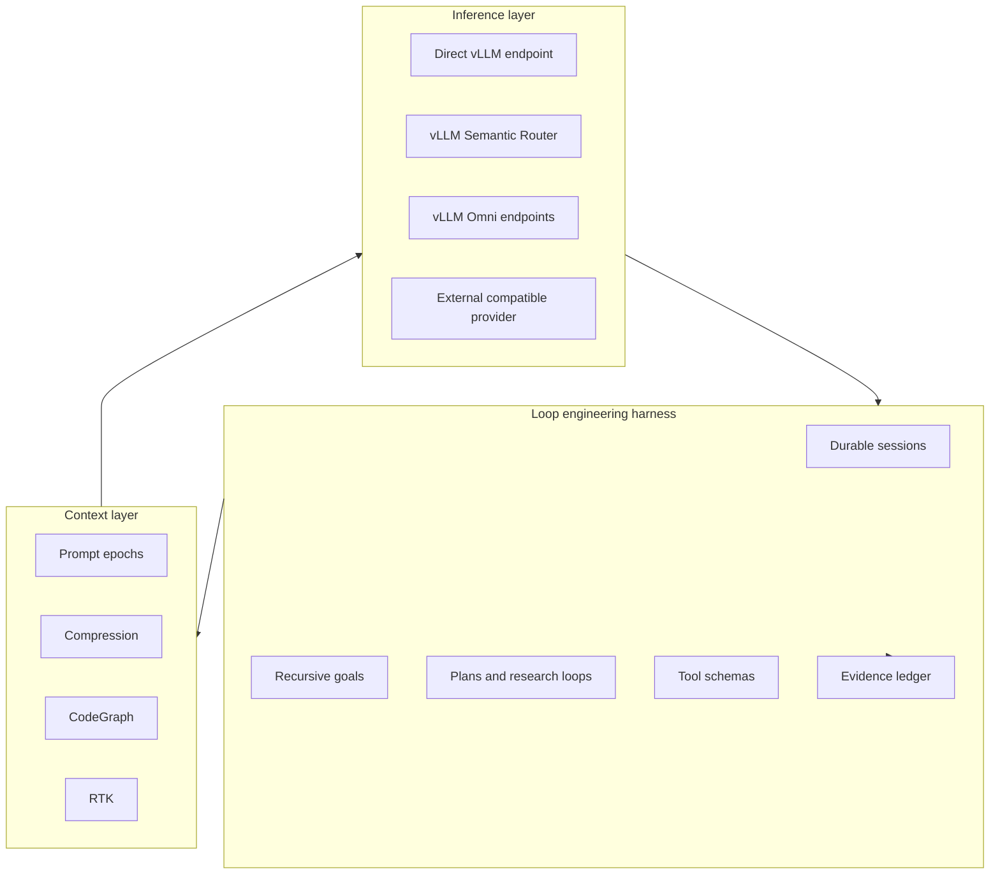

Inferoa is organized around loop engineering on the tokenmaxxing path. For the
full glossary and concept relationships, see
[System concepts](./concepts/system-concepts.md).

## Agent Harness

The harness owns durable sessions, recursive loops, plans, research state,
tool traces, managed resources, recovery, and verification. These are not just
UI features; they define the state that long-horizon inference has to preserve.

Loop mode is the loop-engineering surface: it keeps the outcome, loop tasks,
candidate work, evidence, decisions, and completion report active while the
agent continues working.

## Prefix Cache Discipline

Prefix cache is a core design target. Inferoa protects it with stable prompt
epochs, deterministic tool schema ordering, bounded mutable context, and
separate warmup versus steady-state cache reporting. See
[Prefix cache](./concepts/prefix-cache.md) for the prompt-epoch model.

## Context Optimization

Context optimization selects what the next turn actually needs. CodeGraph,
RTK, summaries, symbols, resources, and tool outputs are used to reduce token
waste while preserving the evidence required for accurate coding work. See
[Context optimization](./concepts/context-optimization.md) for the
lifecycle and defaults.

## Intelligent Routing

Routing is part of agent policy. vLLM Semantic Router can choose model paths by
cost, safety, privacy, capability, and session pressure instead of forcing
every turn through the same model. See
[Model endpoints](./configuration/model-endpoints.md) for the configuration
shape and the `auto` mode that delegates routing to vLLM Semantic Router.

## Self-Hosted Model Serving

vLLM Engine provides high-performance OpenAI-compatible serving. Inferoa treats
usage, cache behavior, endpoint capability, and request metadata as signals the
agent can surface and eventually act on.

## Multimodal

vLLM Omni extends the self-hosted serving path with image, video, and audio
understanding or generation. Multimodal outputs are tracked as session
artifacts instead of disconnected side calls. See [vLLM Omni](./configuration/omni.md)
for configured endpoints and `/doctor` for user-facing endpoint health.
