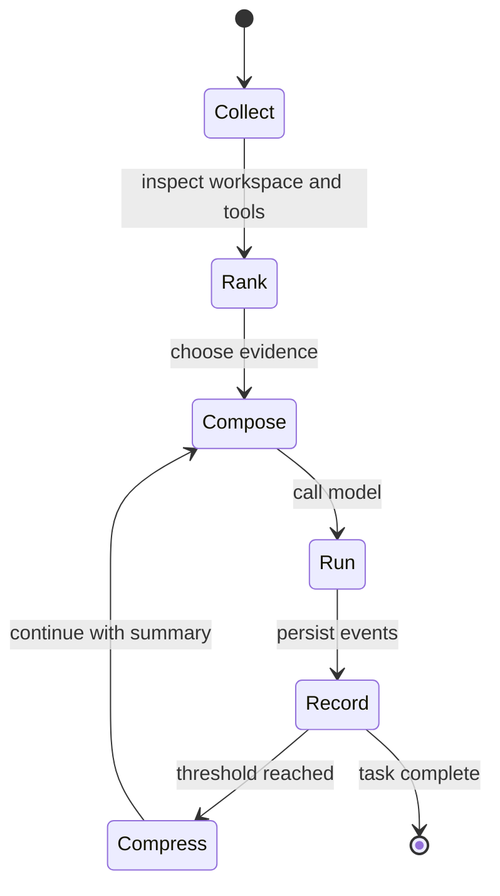

Context optimization decides what the next model call actually needs. Inferoa
uses a layered approach: recent dialogue stays protected, older context can be
compressed, repository evidence is selected, and large tool outputs are folded
or stored as resources.

## Lifecycle



## Defaults

Inferoa defaults to:

- `context.compression_threshold: 0.8`
- `context.context_window: 32768`
- `context.protected_recent_loops: 3`
- `context.engine.provider: auto`
- `context.engine.startup: welcome`

These settings keep recent tool loops visible while allowing older material to
move into summaries or managed resources.

## Code Intelligence

When available, the context engine uses repository structure and symbols to
avoid broad file reads. It can combine built-in search with CodeGraph and RTK
so the agent retrieves targeted evidence rather than repeatedly dumping large
files into the prompt.

## Manual Controls

Use:

```text
/context
/context reindex
/tools compact
/tools expand
```

`/context` shows usage and compression state. `/context reindex` rebuilds the
context index. `/tools compact` folds long successful tool traces, while
`/tools expand` opens the latest folded trace when you need detail.
