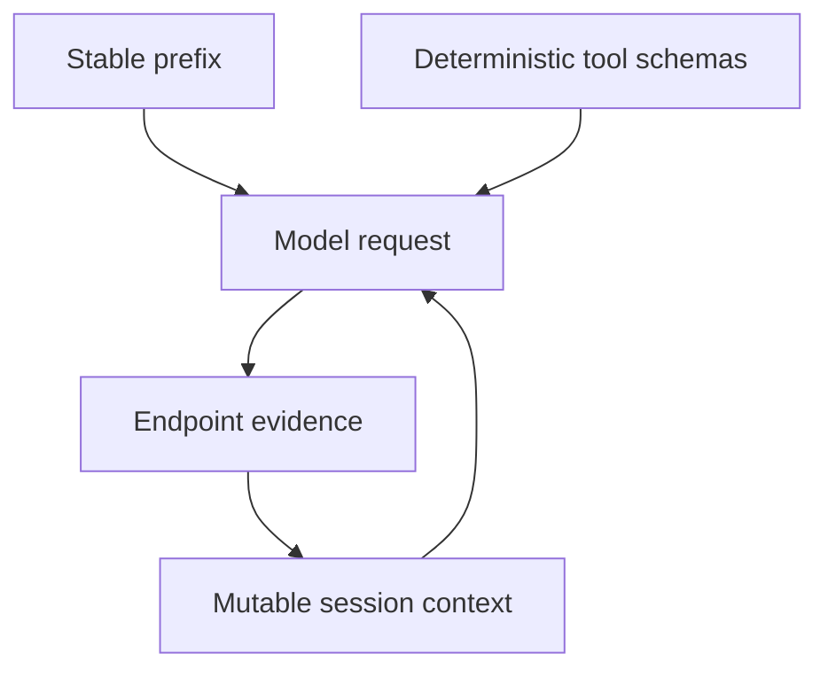

Prefix-cache discipline keeps stable prompt material stable across turns. The
goal is to let compatible serving engines reuse as much prompt work as possible
without hiding the evidence needed for accurate agent behavior.

## Prompt Epochs

Inferoa records prompt epochs with:

- provider id;
- model id;
- cache salt;
- prompt layout hash;
- tool schema hash;
- section hashes.

An epoch changes when the stable prompt layout changes. Ordinary task progress
should mostly alter bounded mutable sections, not the stable prefix.

## Endpoint Evidence

When the provider exposes usage fields, Inferoa records prompt tokens, cached
prompt tokens, request ids, response ids, model id, and headers that help
diagnose routing or cache behavior.

Not every provider reports cache details. In those cases, Inferoa omits cache
hit fields rather than fabricating a number.
