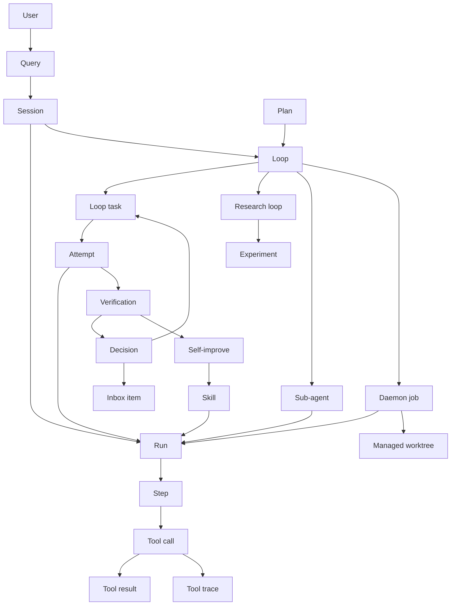
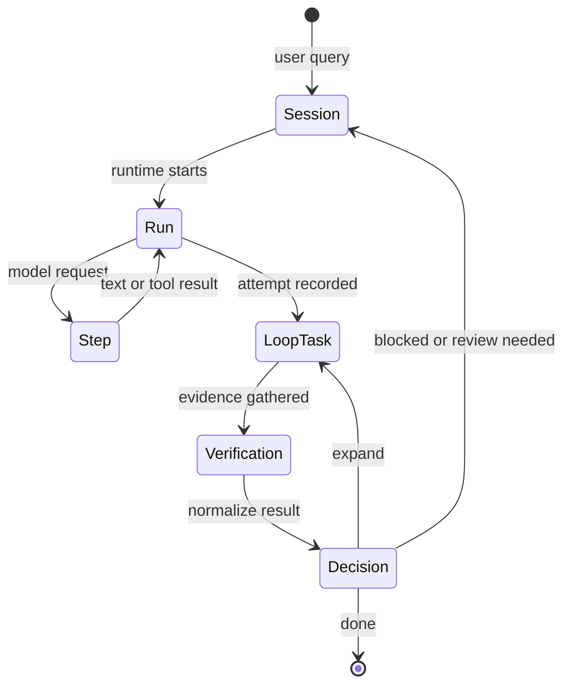

Inferoa uses a small set of product concepts to describe long-horizon agent
work. The code still contains some older internal names, such as `Goal*`, but
the user-facing model is loop-based.

## Concept Map

## Core Terms

| Term | Meaning | Relationship |
| --- | --- | --- |
| Query | A user input submitted to Inferoa. | A query starts or continues a session. It may create a normal run, start a loop, or invoke a command. |
| Session | Durable conversation and event state for one workspace interaction. | A session contains user messages, runs, tool traces, resources, loop state, and memory. |
| Run | One execution of the agent runtime from prompt to terminal result. | A run can include multiple model steps and tool calls. A loop task can have many attempts, and each attempt is backed by a run. |
| Step | One model request and response cycle inside a run. | A step may produce assistant text, tool calls, or both. Tool calls and results are attached to the step that produced them. |
| Tool call | A structured action requested by the model or runtime. | Tool calls produce tool results and are rendered in the tool trace. |
| Tool result | The structured outcome of a tool call. | Tool results become evidence for the current run and may feed verification or memory. |
| Tool trace | The readable projection of model steps, tool calls, and tool results. | Tool trace is the session-level evidence trail for what happened during execution. |
| Resource | A durable artifact produced or registered by a run. | Resources include files, fetched URLs, generated media, and managed artifacts that future runs can reference. |

## Loop Terms

| Term | Meaning | Relationship |
| --- | --- | --- |
| Loop | Durable controller for a long-horizon objective. | A loop owns loop tasks, attempts, verification, decisions, candidate work, and completion evidence. |
| Loop kind | The loop's execution family. | `task` is the default. `research` reuses the loop engine with experiment and metric gates. |
| Approach | How broadly the loop should pursue the objective. | `auto`, `focus`, `explore`, and `timebox` guide loop task expansion and completion behavior. |
| Loop task | A bounded generation of loop work. | Loop task 0 is orientation. Later loop tasks are created by `expand` decisions when the original objective needs more work. |
| Attempt | One runtime attempt to make progress on a loop task. | Attempts are runs interpreted through the active loop task. An attempt may be visible work, verification, reflection, or internal control. |
| Verification | Structured evidence about whether an attempt or loop task satisfies the objective. | Verification can come from tests, commands, research metrics, connector checks, human review, or checker runs. |
| Decision | The loop's normalized judgment after evidence is available. | `expand` opens a new loop task, `done` completes the loop, and `blocked` pauses for user input or external state. |
| Candidate ledger | Structured list of open, completed, and rejected work candidates. | Broad loops cannot silently finish while high-value candidates remain open. |
| Human review | Optional human-in-the-loop checkpoint between loop decisions and continuation. | Review can approve, reject, revise, or block a staged decision. |
| Completion evidence | The final proof attached to a completed loop. | A loop is complete only after semantic completion is verified, not merely because a checklist is empty. |

## Learning Terms

| Term | Meaning | Relationship |
| --- | --- | --- |
| Memory spine | Durable evidence used to make later runs better. | It is built from sessions, loop state, attempts, verification records, resources, skill snapshots, and learning signals. |
| Skill | Reusable workspace or user policy loaded into future prompts. | Skills are treated as loop policy, not as one-off prompt text. |
| Skill snapshot | The enabled skill state captured at attempt start. | Snapshots make it possible to understand which policy shaped a run. |
| Learning signal | A distilled observation from verified evidence or feedback. | Learning signals can become self-improve proposals. |
| Self-improve | Reviewable process for turning verified loop evidence into a skill. | `/self-improve` stages a proposal, runs structured replay/gating, and adopts only on explicit command. |
| Replay report | Structured gate result for a self-improve proposal. | It shows whether the proposed skill improves validation samples without regressing heldout samples. |

## Work Management Terms

| Term | Meaning | Relationship |
| --- | --- | --- |
| Inbox item | A projected item that needs attention. | Inbox items can represent pending review, blockers, failed verification, staged skill proposals, stale work, or daemon state. |
| Daemon job | Background execution record. | Daemon jobs can continue loops, run verification, or process promoted inbox work. |
| Sub-agent | A child agent run delegated by the main agent. | Sub-agents are loop-scoped helpers for focused investigation, implementation, or review. |
| Managed worktree | Isolated git worktree for background or review-gated work. | Worktrees keep loop work separate from the active checkout until adoption. |
| Connector | Structured integration surface for an external system. | Connectors can provide discovery, verification, or action capabilities. |
| Connector verifier | A connector-specific verification check. | Examples include GitHub PR status, GitHub Actions runs, npm package state, HTTP health, and local git cleanliness. |
| Connector action | A structured mutating operation against an external system. | Actions are gated by policy and often start as dry-runs before interactive execution. |

## Planning And Research Terms

| Term | Meaning | Relationship |
| --- | --- | --- |
| Plan | Reviewable scope document before execution. | Plan mode is useful when the user wants approval before edits. An approved plan can seed loop task steps. |
| Research loop | A `research` kind loop with experiment and metric discipline. | It uses the same loop engine, but completion requires metric evidence and no pending benchmark run. |
| Experiment | One hypothesis or solution line inside a research loop. | Experiments can be created, continued, completed, or rejected across research loop tasks. |
| Metric evidence | Parsed benchmark or evaluation output. | Research loops use metric evidence as first-class verification. |

## Inference And Context Terms

| Term | Meaning | Relationship |
| --- | --- | --- |
| Tokenmaxxing | Inferoa's discipline for reducing wasted inference. | It tracks prefix-cache reuse, context pressure, model-call cost, routing, RTK savings, and long-run usage. |
| Prompt epoch | Stable prompt prefix version for a session. | Epochs keep cacheable prompt sections stable while mutable context changes. |
| Context compression | Controlled summarization of older session state. | Compression protects recent user intent, active loop state, and evidence while reducing token pressure. |
| RTK | Runtime tool-output rewriting and savings path. | RTK can reduce tool-output tokens while preserving structured evidence. |
| Model route | The selected inference path for a model step. | Routes can use direct endpoints, vLLM Semantic Router, vLLM Omni, or compatible external providers. |

## Lifecycle

The important boundary is between a run and a loop:

- a run is one runtime execution;
- a loop is durable work across runs;
- a loop task is the current bounded slice of loop work;
- an attempt is a run interpreted as progress, verification, or control for a
  loop task;
- verification and decisions decide whether the loop continues, pauses, or
  completes.

## Product Names And Internal Names

Some implementation modules still use `Goal*` names. Treat those as internal
state and migration history. Product documentation, slash commands, and user
flows should use:

- `loop`, not goal;
- `loop task`, not horizon;
- `attempt`, not generic run when discussing loop progress;
- `decision`, not reflection, for the user-visible loop judgment;
- `self-improve`, not opt.
