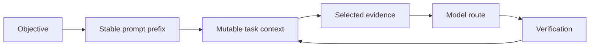

Tokenmaxxing is Inferoa's discipline for spending inference tokens where they
change the outcome. It is not only compression. It combines prompt stability,
context selection, routing, endpoint evidence, and verification.



## Surfaces

| Surface | What Inferoa Tracks | Why It Matters |
| --- | --- | --- |
| Prompt prefix | Prompt epochs, section hashes, tool schema hash | Avoid invalidating reusable prefixes |
| Context | Thresholds, protected recent loops, summaries | Keep the next turn focused |
| Tools | Deterministic schemas and bounded outputs | Reduce schema churn and output bloat |
| Endpoint | Provider, model, usage, request ids, cache fields | Make inference behavior inspectable |
| Artifacts | Managed resources for generated media and evidence | Avoid pasting large payloads into prompts |

## Reading Token Pressure

Use:

```text
/tokenmaxxing
```

The view reports recent token usage, cache evidence when the endpoint exposes
it, RTK savings, context pressure, and model-selection pressure. Cache fields
are shown only when the provider returns enough usage detail to make them
meaningful.
