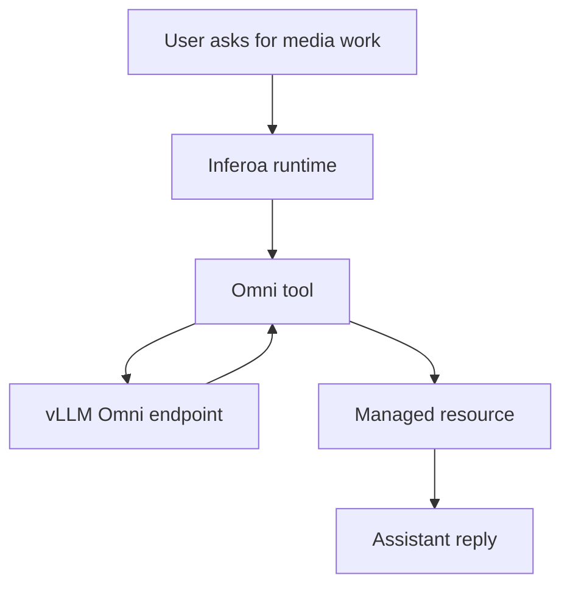

Inferoa treats multimodal capabilities as endpoint-backed tools. A single main
chat model can delegate image, video, audio, or speech work to configured
vLLM-Omni-compatible endpoints.

## Capabilities

Supported endpoint keys are:

- `vision`
- `image_generation`
- `image_edit`
- `video_understanding`
- `video_generation`
- `audio_understanding`
- `audio_generation`
- `speech`

The exact capabilities depend on the served model profile and routes exposed by
the endpoint. A route being present is not enough for acceptance; a compatible
profile must complete a real tool invocation.

## Example Configuration

```yaml
omni:
  enabled: true
  endpoints:
    vision:
      base_url: http://localhost:8091/v1
      model: qwen2.5-omni-7b
    image_generation:
      base_url: http://localhost:8092/v1
      model: image-model
    video_generation:
      base_url: http://localhost:8093/v1
      model: video-model
```

Use `/setup` for interactive configuration so secrets are stored in the vault.

## Artifact Handling

Generated media is stored as managed resources rather than pasted into the
prompt. This keeps prompts smaller and preserves stable references in the
session log.



## Validation

Use the runtime validation commands when working against real Omni endpoints:

```bash
npm run validate:omni-real
npm run validate:omni-e2e-runtime
```

See [Acceptance](../operations/acceptance.md) for the release-quality workflow.
