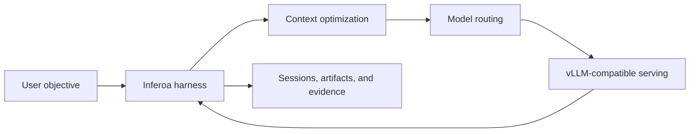

Inferoa is an **Inference-native Tokenmaxxing Agent Harness** for long-horizon
coding and research work in the vLLM ecosystem.

Most agents treat inference as a black-box chat API. Inferoa starts from the
opposite direction: the agent loop is designed around the optimization surfaces
that modern inference systems expose. Long sessions, prefix-cache discipline,
context pressure, model routing, self-hosted serving signals, multimodal
artifacts, and verification belong to one durable harness.

## What Inferoa Coordinates

- **Long-horizon modes** keep goals, plans, autoresearch state, and completion
  audits attached to a durable session.
- **Prefix-cache discipline** keeps the stable parts of the prompt stable, so
  reusable prefixes are not invalidated by avoidable churn.
- **Context optimization** selects the evidence needed for the next turn using
  summaries, code intelligence, bounded tool output, and RTK.
- **Intelligent routing** can choose model paths by cost, safety, privacy,
  capability, and current session pressure.
- **Self-hosted serving** uses vLLM Engine-compatible endpoints as first-class
  inference surfaces instead of opaque chat backends.
- **Multimodal execution** routes image, video, audio, and speech work through
  vLLM-Omni-compatible endpoints and stores produced media as managed
  artifacts.

## Why Coding First

Coding is a high-pressure long-horizon task: large repositories, tool failures,
context limits, repeated model calls, and proof through tests all appear in the
same workflow. That makes it a strong first domain for co-designing agent
behavior with inference behavior.

## Documentation Map

- Start with [Quickstart](./quickstart.md) when you want to run Inferoa.
- Read [Architecture](./architecture.md) when you want the system model.
- Use [Model endpoints](./configuration/model-endpoints.md) when connecting
  direct vLLM, vLLM Semantic Router, or an external compatible provider.
- Use [Goal, plan, and autoresearch](./workflows/goal-plan-autoresearch.md)
  when structuring long-running work.
- Use [CLI reference](./reference/cli.md) and
  [Slash commands](./reference/slash-commands.md) when you need exact command
  names.

## Current Implementation

Inferoa is a TypeScript and Node.js terminal application. It stores local state
under `~/.inferoa/` by default and keeps raw endpoint secrets in the local vault
instead of plain configuration files.
