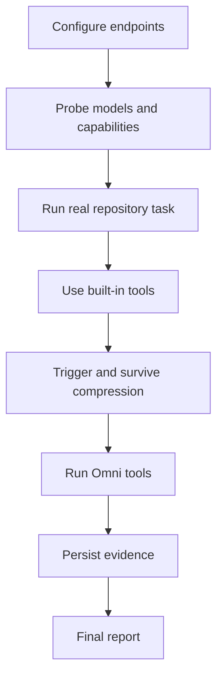

Acceptance proves that Inferoa can complete a real task through the same
runtime paths users rely on: model calls, tools, sessions, context compression,
endpoint evidence, and multimodal resources.

## Health Check

```text
/doctor status
/doctor run
/doctor tools
```

The doctor view checks the configured coding endpoint, daemon state, tools, and
optional Omni routes. Missing Omni endpoints are reported as optional
capabilities, not as failures. `/doctor tools` queues an in-session agent
regression of representative built-in tools and asks the agent to return a
test report plus improvement suggestions.

## Release Runner

Strict release acceptance is intentionally separate from the user health check.
The repository includes a debug runner:

```bash
npm run build
node dist/src/cli.js debug acceptance --daemon
```

The debug runner is useful for automation and release-gate validation. It can
require direct vLLM and Omni endpoints that are not expected in every user
environment.

## Required Evidence

An acceptance report should include:

- repository and task description;
- configured provider, direct vLLM, router, and Omni endpoints;
- model names;
- files changed;
- tool calls used by category;
- tests or commands run;
- context compression evidence;
- endpoint usage and cache evidence when exposed;
- managed resources for multimodal artifacts;
- session id and resume evidence;
- daemon attach, detach, status, and cancel evidence when daemon behavior is in
  scope.

## Pass Flow



Acceptance should not pass on mock-only evidence or manual calls outside the
Inferoa runtime loop.
