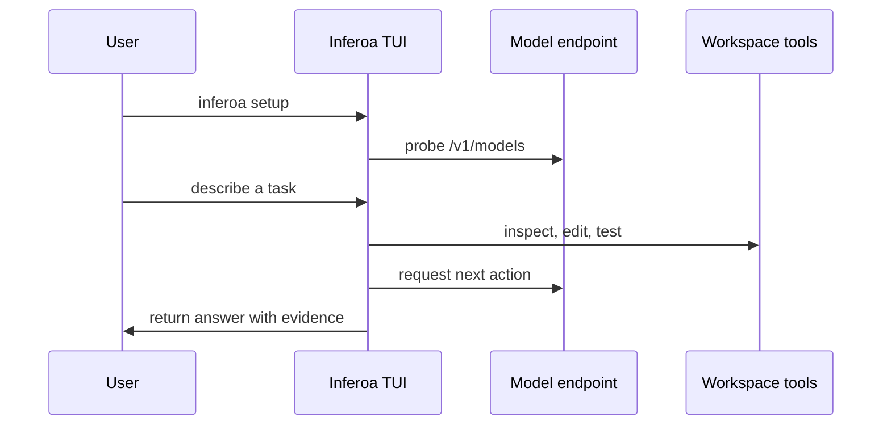

This quickstart gets Inferoa running against an OpenAI-compatible endpoint. For
local development in this repository, build and link the CLI:

```bash
npm install
npm run build
npm link
```

Then start the setup wizard and launch the TUI:

```bash
inferoa setup
inferoa
```

Run a one-shot prompt without opening the interactive interface:

```bash
inferoa --print "Inspect this repository and summarize the test entrypoints."
```

## Basic Loop



## First Commands

- Use `/setup` when you need to change provider, model, endpoint, web search,
  or Omni configuration.
- Use `/system` to inspect model, web search, Omni, and runtime status.
- Use `/goal set` for a durable objective that should survive multiple turns.
- Use `/plan set` for ambiguous work that needs an inspectable plan before
  execution.
- Use `/tokenmaxxing` to see token, cache, RTK, and routing pressure.

Useful development commands:

```bash
npm test
make docs-preview
make docs-build
```

Configuration is stored under `~/.inferoa/`. Endpoint keys are stored in the
local vault; config files store key references.
