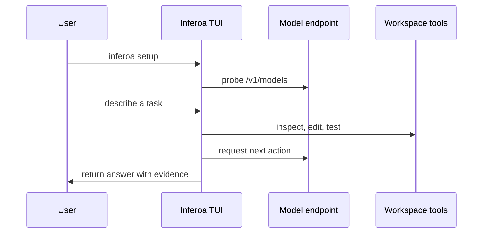

This quickstart gets Inferoa running against an OpenAI-compatible endpoint.

Install the CLI globally:

```bash
npm install -g inferoa@dev
```

`@dev` installs the newest Inferoa build published from `main`. The npm
`latest` dist-tag is reserved for stable release versions. Node.js 24 or
newer is required.

Then start the setup wizard and launch the TUI:

```bash
inferoa setup
inferoa
```

Pass a prompt as an argument to start a session and submit it as the first user
turn:

```bash
inferoa "Inspect this repository and list the test entrypoints."
```

Run a one-shot prompt without opening the interactive interface:

```bash
inferoa --print "Inspect this repository and summarize the test entrypoints."
```

## Basic Loop



## First Commands

Slash commands live inside the TUI. See
[Slash commands](./reference/slash-commands.md) for the full registry.

- Use `/setup` to change provider, model, endpoint, web search, or Omni
  configuration.
- Use `/system` (also `/endpoints`) to inspect model, web search, Omni, and
  runtime status.
- Run [`/loop`](./workflows/loop-mode.md) to start a recursive long-horizon
  loop.
- Run `/loop mode research` for experiment-shaped work that needs repeated
  measurement.
- Use [`/plan set`](./workflows/plan-mode.md) for ambiguous work that needs an
  inspectable plan before execution.
- Use `/tokenmaxxing` (also `/cache`, `/rtk`, `/activity`) to see token, cache,
  RTK, and routing pressure.
- Use `/access` to change this workspace's file and tool access mode.

## Repository Development

When working from a source checkout, install dependencies, build, and link the
local CLI:

```bash
npm install
npm run build
make dev-bin
inferoa setup
inferoa
```

Useful development commands:

```bash
npm test
make docs-preview
make docs-build
make dev-unlink
```

Configuration is stored under `~/.inferoa/`. Endpoint keys are stored in the
local vault; config files store key references. See the
[Configuration reference](./reference/configuration.md) for the full schema
and environment overrides.

## Next Steps

Once Inferoa is running, explore the long-horizon workflows:

- [First session](./getting-started/first-session.md) walks through a complete
  task loop — describing work, using modes, inspecting evidence, and resuming
  later.
- [Loop mode](./workflows/loop-mode.md) is the loop-engineering surface for
  recursive long-horizon loops.
- [Plan mode](./workflows/plan-mode.md) turns ambiguous scope into an
  inspectable plan before execution.
- Research loops under [Loop mode](./workflows/loop-mode.md) run
  benchmark-style iteration with metrics and failure evidence.
- [Architecture](./architecture.md) explains the system model and how the
  harness, context layer, and inference layer connect.
