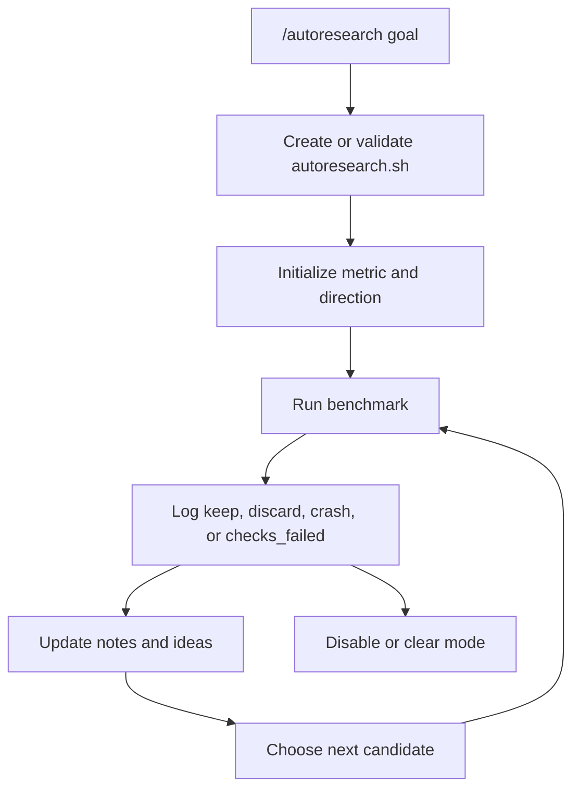

Autoresearch mode is for experiment-shaped work. It keeps a benchmark harness,
metric direction, run history, failures, and candidate ideas in the same
session as the code changes.

## When To Use It

Use autoresearch when:

- progress depends on repeated measurement;
- there is a primary metric to improve or protect;
- failed runs and discarded ideas need to remain visible;
- benchmark output should become evidence for later decisions.

Do not use autoresearch for ordinary feature work without a measurable loop. Use
[Goal mode](./goal-mode.md) for durable implementation work and
[Plan mode](./plan-mode.md) when the scope needs approval first.

## Basic Commands

```text
/autoresearch reduce benchmark latency without hurting accuracy
/autoresearch status
/autoresearch off
/autoresearch clear
```

The first command enters the workflow. The agent should create or update
`./autoresearch.sh`, validate it, and initialize the experiment with the
autoresearch tools.

## Harness Contract

Autoresearch expects a workspace harness at:

```text
./autoresearch.sh
```

The harness should print the primary metric in a parseable form:

```text
METRIC latency_ms=123.4
```

The experiment records the primary metric, direction, secondary metrics, run
descriptions, crash or check-failure evidence, and optional structured
autoresearch metadata.

## How It Works



A run is not just a command output. It becomes session evidence: what changed,
which metric was observed, whether the result was kept, and why failed attempts
were rejected.

## Relationship To Other Modes

Autoresearch can support a goal when the goal depends on measured improvement.
For example, goal mode can preserve the durable objective while autoresearch
records the benchmark loop that proves whether each candidate helps.
