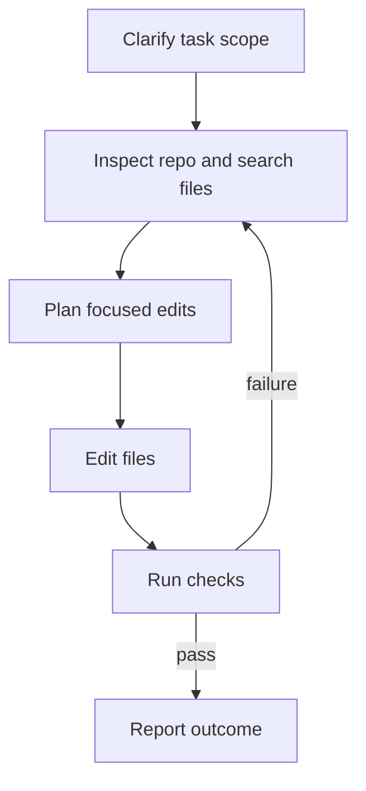

Inferoa is optimized for repository work where the answer must be proven by
inspection, edits, commands, and evidence.

## Recommended Loop



## What The Agent Should Do

For non-trivial coding tasks, Inferoa should:

- inspect the repository before deciding where to edit;
- prefer targeted search and code intelligence over broad file dumps;
- keep tool output bounded and expand it only when needed;
- edit only the files required by the task;
- run the narrowest meaningful verification first;
- report changed files and commands run.

## Useful Commands

```text
/tools last                  Show the latest tool call
/context                     Show context and compression state
/doctor status               Check endpoint, tool, and optional Omni health
/doctor tools                Ask the agent to regress built-in tools in-session
```

Use `/tools last` when you want to inspect the latest tool call. Use `/context`
when the repository is large or the session has been running long enough to
trigger compression. Use `/doctor status` when checking the local endpoint
setup before a coding session. Use `/doctor tools` when you want the current
agent to run a real built-in tool regression and return a report. See
[Slash commands](../reference/slash-commands.md) for the full command
registry, including aliases.
