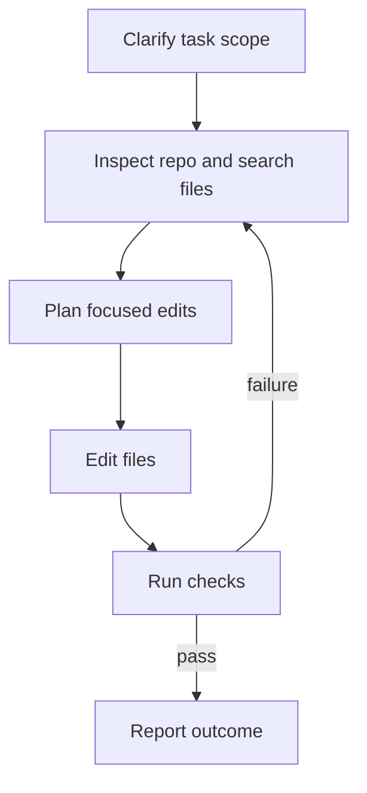

Inferoa is optimized for repository work where the answer must be proven by
inspection, edits, commands, and evidence.

## Recommended Loop



## What The Agent Should Do

For non-trivial coding tasks, Inferoa should:

- inspect the repository before deciding where to edit;
- prefer targeted search and code intelligence over broad file dumps;
- keep tool output bounded and expand it only when needed;
- edit only the files required by the task;
- run the narrowest meaningful verification first;
- report changed files and commands run.

## Useful Commands

```text
/tools last
/context
/todo
/acceptance status
```

Use `/tools last` when you want to inspect the latest tool call. Use `/context`
when the repository is large or the session has been running long enough to
trigger compression. Use `/todo` for the task ledger and `/acceptance status`
when validating a release-quality endpoint setup.
