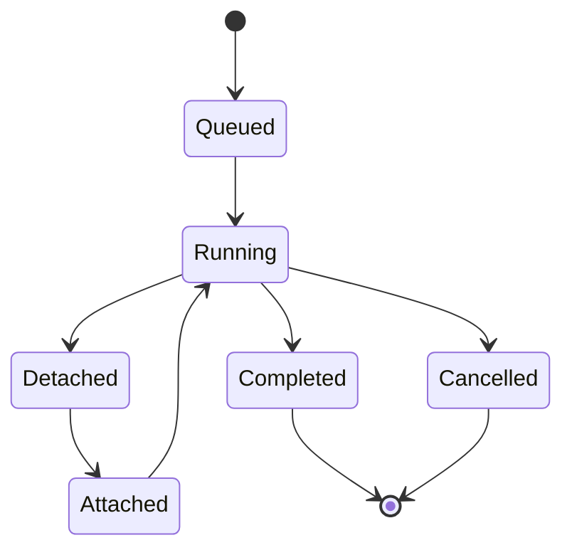

The daemon path runs supervised work outside the foreground TUI. It is useful
for long-running tasks that should survive terminal detach and later reattach.

## TUI Commands

```text
/jobs status
/jobs queue
/jobs attach
/jobs detach
/jobs cancel
```

## Debug Commands

```bash
inferoa debug daemon start
inferoa debug daemon status
inferoa debug daemon jobs
```

The CLI also supports daemon run, goal, attach, detach, and cancel subcommands.
Use `inferoa --help` for the full debug command surface.

## Job Lifecycle



The session event log stores job state changes so a later TUI can inspect what
happened while the terminal was detached.
