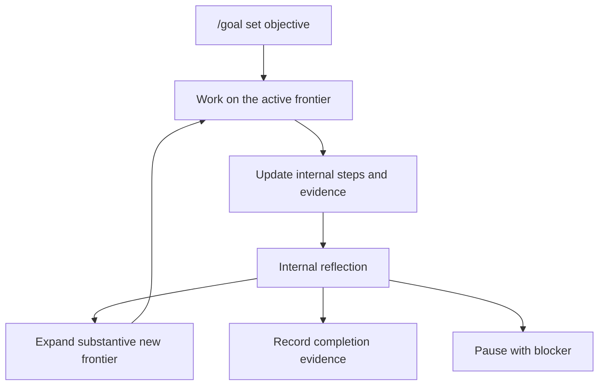

Goal mode keeps a durable objective active until the work is genuinely handled.
Use it when a task may span multiple turns, context compaction, tool failures,
verification passes, or a later resumed session.

## When To Use It

Use goal mode when the desired outcome is clear but the work is long:

- the agent needs to keep working until an objective is complete;
- progress needs an internal checklist, evidence, and status;
- completion should not depend on a single assistant turn;
- you want the session to preserve the objective across interruptions.

Do not use goal mode as a substitute for planning ambiguous scope. If the task
needs approval before edits begin, start with [Plan mode](./plan-mode.md).

## Basic Commands

```text
/goal set Improve the docs site and verify the Docusaurus build.
/goal show
/goal budget 200000
/goal plan
/goal complete
/goal pause
/goal resume
/goal drop
```

## How It Works



The active goal stores:

- the original objective;
- an internal goal plan and step status;
- notes and structured evidence;
- token, tool, and time usage;
- the latest internal reflection decision.

The agent should keep step status and evidence current while working. An empty
checklist is not enough to finish the goal.

## Reflection And Completion

When the current frontier appears exhausted, Inferoa runs an internal
reflection. Reflection steps back from the current plan and asks whether more
work is needed to satisfy the original objective.

Reflection has a hard stop condition: it only expands the frontier when the new
work has substantive impact on the original objective. Otherwise it records
`decision=done` with verification evidence. If completion cannot proceed without
user input or an external state change, it records `decision=blocked`.

Goal completion is gated by reflection. A visible `/goal complete` cannot bypass
unfinished internal steps or the latest reflection requirement.

## Relationship To Other Modes

Use [Plan mode](./plan-mode.md) before goal mode when the scope needs approval.
Use [Autoresearch mode](./autoresearch-mode.md) inside or alongside a goal when
the work depends on repeated measurement.
