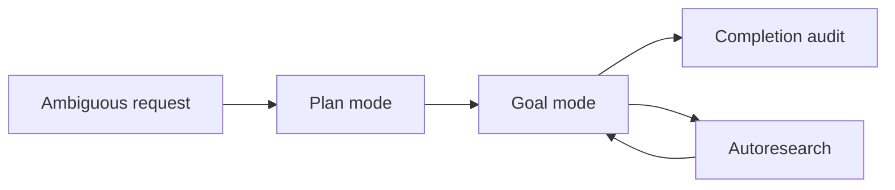

Inferoa separates three long-horizon modes because they solve different
coordination problems.

| Mode | Use It When | Primary Command |
| --- | --- | --- |
| Goal | Work should continue until an objective is complete | `/goal set` |
| Plan | Scope is ambiguous and needs approval before execution | `/plan set` |
| Autoresearch | You need iterative experiments with metrics and failure evidence | `/autoresearch` |

## Goal Mode

Goal mode keeps a durable objective, plan, evidence, and completion audit.

```text
/goal set Improve the docs site and verify the Docusaurus build.
/goal show
/goal budget 200000
/goal complete
```

Use goal mode for work that may span interruptions, compaction, multiple tool
rounds, or a later completion audit.

## Plan Mode

Plan mode turns ambiguous scope into an inspectable plan:

```text
/plan set Design the docs sidebar before writing new pages.
/plan show
/plan approve
```

Use it when you want explicit sequencing before edits begin.

## Autoresearch Mode

Autoresearch mode is for benchmark-style loops where the agent needs to record
measurements, failures, and candidate improvements in the same session.

```text
/autoresearch status
/autoresearch off
/autoresearch clear
```

## Relationship



The modes can support each other, but they should not be treated as synonyms.
Plan mode clarifies sequencing, goal mode preserves durable intent, and
autoresearch records experimental iteration.
