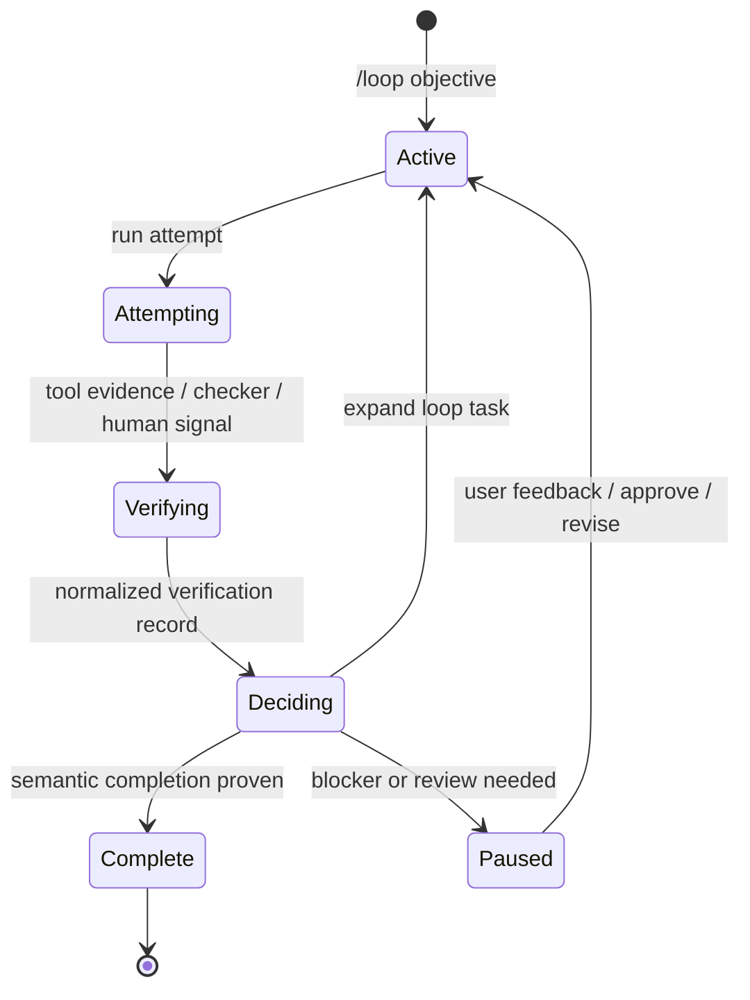

Loop mode is Inferoa's loop-engineering surface for recursive long-horizon
work. Run `/loop` to define the outcome once; Inferoa keeps inspecting,
changing, testing, verifying, deciding, and continuing until the work is proven.

Use it when a task may span multiple turns, context compaction, tool failures,
verification passes, or a later resumed session.

## When To Use It

Use loop mode when the desired outcome is clear but the work is long:

- the agent needs to keep working until an objective is complete;
- progress needs an internal checklist, evidence, and status;
- completion should not depend on a single assistant turn;
- you want the session to preserve the objective across interruptions.

Do not use loop mode as a substitute for planning ambiguous scope. If the task
needs approval before edits begin, start with [Plan mode](./plan-mode.md).

## Basic Commands

```text
/loop Improve the docs site and verify the Docusaurus build.
/loop mode auto Improve the docs site and verify the Docusaurus build.
/loop mode focus Fix the failing parser test and verify it.
/loop mode explore Improve this package and handle related high-value issues.
/loop mode timebox 2h Audit this repository and improve the highest-value rough edges.
/loop mode research Reduce benchmark latency without hurting accuracy.
/loop mode research explore Find and validate latency improvement hypotheses.
/loop status
/loop pause
/loop resume
/loop drop
```

`/loop status` displays the active loop, current loop task, attempts, verification,
skills, pending review state, and latest loop decisions.

## Kind And Approach

Bare `/loop <objective>` starts a task loop with automatic approach selection.
Inferoa first runs loop task 0 orientation, then decides how broadly to pursue
the objective.

Loop kind:

- `task` is the default for ordinary implementation, investigation, and
  verification work.
- `research` is for metric-driven experimental loops that need benchmark
  harnesses, hypotheses, runs, and metric evidence.

Approach:

- `auto` lets Inferoa choose after orientation.
- `focus` keeps the work scoped to the current objective.
- `explore` allows related high-value directions.
- `timebox` keeps working until a time checkpoint, then records a loop decision.

Use `/loop` with no arguments to open the creation flow. If no loop is active,
Inferoa asks for the objective, loop kind, and approach.

## How It Works



The active loop stores:

- the original objective;
- loop kind (`task` or `research`);
- an internal loop task plan and step status;
- the current loop task, starting with loop task 0 orientation;
- attempts, which are runs interpreted as work on the loop task;
- verification records from commands, research metrics, checker runs, human
  review, or structured model evidence;
- an inferred or selected approach (`auto`, `focus`, `explore`, or `timebox`);
- a candidate ledger of open, completed, and rejected work;
- notes, resources, tool traces, skill snapshots, token usage, tool usage, and
  time usage;
- the latest loop decision.

The agent should keep step status and evidence current while working. An empty
checklist is not enough to finish the loop.

## Decisions And Completion

When the current loop task appears exhausted, Inferoa runs an internal decision
pass. The decision pass steps back from the current plan and asks whether more
work is needed to satisfy the original objective.

The decision has three useful outcomes:

- `expand`: open a new loop task with concrete steps that materially affect the
  original objective;
- `done`: record evidence-backed semantic completion;
- `blocked`: pause because user input or an external state change is required.

For broad loops, completion is also gated by the candidate ledger. If a decision
says `done` while high-value candidates remain open, Inferoa expands the next
loop task instead of silently finishing.

Loop completion is gated by verification and loop decisions. A loop is not done
because the checklist is empty; it is done after verification records
evidence-backed semantic completion.

## Research Loops

Research loops reuse the same loop supervisor, but each loop task is shown as a
research cycle. A research cycle can create, continue, complete, or reject
multiple experiments. Each experiment represents one hypothesis or solution
line, and each run records benchmark output and parsed `METRIC name=value`
evidence.

Research completion requires logged metric evidence. The loop cannot complete
while a benchmark run is pending, and a `done` decision should cite run history,
the best observed metric, and guardrail or regression evidence.

## Self-Improve

`/self-improve` and `inferoa self-improve` turn verified loop evidence into a
reviewable workspace skill proposal. The first implementation uses structured
replay/gating over recorded evidence rather than a live model rerun:

```text
/self-improve status
/self-improve propose
/self-improve run --replay
/self-improve report
/self-improve adopt
```

Self-improve artifacts are stored under `.inferoa/self-improve/`, and adopted
skills are written under `.inferoa/skills/`.

## Relationship To Other Modes

Use [Plan mode](./plan-mode.md) before loop mode when the scope needs approval.
