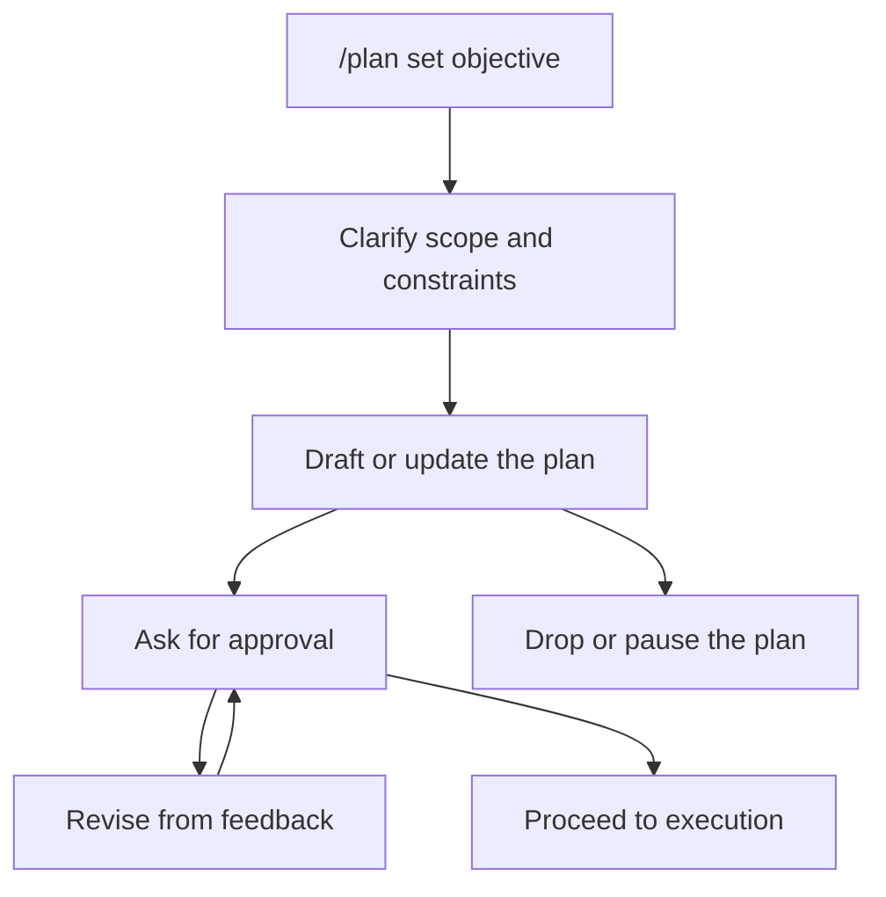

Plan mode turns ambiguous scope into an inspectable plan before execution. Use
it when the main risk is misunderstanding what should be built, changed, or
verified.

## When To Use It

Use plan mode when:

- the request has unclear scope, sequencing, or tradeoffs;
- you want the agent to ask clarifying questions before implementation;
- a human should approve the plan before execution;
- the plan should become durable session context.

Do not use plan mode for routine one-turn work. Do not use it as the main
progress tracker for long execution; after approval, use [Loop mode](./loop-mode.md)
when the work should continue until completion.

## Basic Commands

```text
/plan set Design the docs sidebar before writing new pages.
/plan show
/plan approve
/plan pause
/plan resume
/plan drop
```

## How It Works



Plan mode stores:

- the plan objective;
- the current draft body;
- summary and approval state;
- feedback from declined approval;
- a durable record of when the plan was approved.

The drafting behavior is instruction-driven. The agent is expected to inspect,
ask concise clarifying questions when needed, update the plan, and request
approval before execution. The runtime does not treat plan mode as a filesystem
sandbox; it is a workflow contract for scope control.

## Approval

`/plan approve` asks the user whether to execute the current plan or revise it.
If approval is declined, the agent should incorporate the feedback and ask
again. If there is an active goal, an approved plan can be attached to that goal
so the execution checklist and goal context stay aligned.

## Relationship To Other Modes

Plan mode answers "what should we do?" Loop mode answers "keep working until it
is done." Research loops answer "which measured change is better?" A common
flow is plan first, approve, then execute under a loop.
